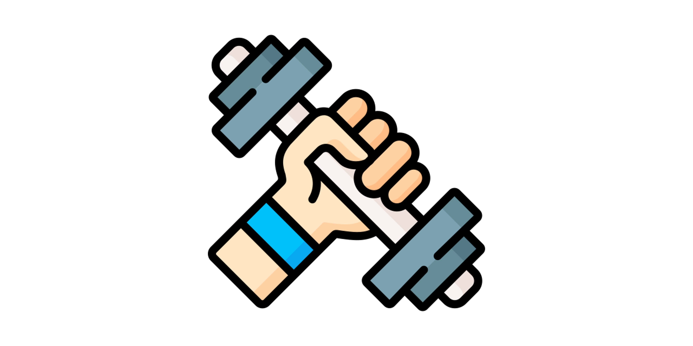

    

## fitability:tm: &ndash; your friendly fitness activity tracking app ##

fitability is an app that runs on your preferred platform &ndash; web, desktop or mobile &ndash; which traces your fitness activities and share them with your friends or social media.

It's all open-sourced under the MIT license.

### Repositories ###

* [fitability-apis](https://github.com/fitability/fitability-apis): Backend APIs
* [fitability-web](https://github.com/fitability/fitability-web): Web app
* [fitability-power](https://github.com/fitability/fitability-power): Power Apps app

### Credits ###

* Icons made by [Freepik](https://www.flaticon.com/authors/freepik) from [www.flaticon.com](https://www.flaticon.com/)

<!--

**Here are some ideas to get you started:**

🙋‍♀️ A short introduction - what is your organization all about?
🌈 Contribution guidelines - how can the community get involved?
👩‍💻 Useful resources - where can the community find your docs? Is there anything else the community should know?
🍿 Fun facts - what does your team eat for breakfast?
🧙 Remember, you can do mighty things with the power of [Markdown](https://docs.github.com/github/writing-on-github/getting-started-with-writing-and-formatting-on-github/basic-writing-and-formatting-syntax)
-->
